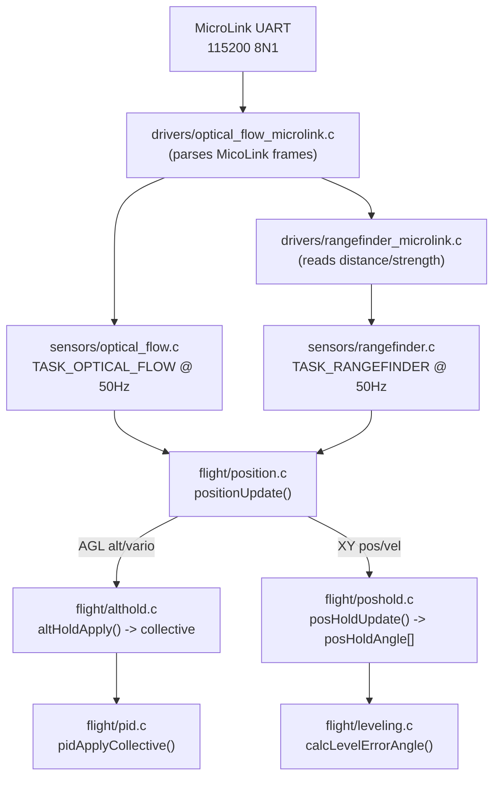

# MicroLink Optical Flow / LIDAR — Altitude Hold & Position Hold

This document describes the changes introduced on the `microlink_poshold` branch
(based on `microlink_driver`, on top of `master` @ `b92aac004`). It covers the new
sensor driver, the new/changed configuration parameters, and a step-by-step guide
for wiring up, configuring and testing Altitude Hold and Position Hold with a
MicroLink MTF-01/MTF-02 module.

> **Status:** experimental / work in progress. See
> [Known limitations](#known-limitations) for what is still unresolved. Bench
> test extensively with props off before any flight test.

---

## 1. Summary of changes

| Area | Change |
| --- | --- |
| New sensor driver | MicroLink MTF-01/MTF-02 combined LIDAR + optical-flow sensor, communicating over a UART at 115200 8N1 using the MicoLink binary protocol |
| New sensor abstraction | A generic "optical flow" sensor layer (`sensors/optical_flow.*`, `drivers/optical_flow/*`), analogous to the existing rangefinder layer |
| Rangefinder | New `MICROLINK` rangefinder hardware option, sourced from the same MicroLink UART stream (shares the driver/port with the optical-flow data) |
| Altitude Hold | New, fully implemented cascade-PID altitude-hold controller (`flight/althold.*`) that prefers LIDAR AGL altitude when available and falls back to baro/GPS altitude |
| Position Hold | New feature (`flight/poshold.*`): a cascade-PID horizontal position-hold controller driven by dead-reckoned XY position/velocity derived from optical flow |
| New flight mode | `BOXPOSHOLD` / `POSHOLD_MODE` — new arming-mode box, requires `ALTHOLD_MODE` to also be active and a valid XY position estimate |
| Position estimator | `flight/position.c` gained an AGL (rangefinder-based) altitude estimator and an optical-flow dead-reckoning XY position/velocity estimator |
| New task | `TASK_OPTICAL_FLOW` @ 50 Hz polls/parses the MicroLink UART stream |
| New debug modes | `DEBUG_OPTICAL_FLOW`, `DEBUG_ALTHOLD`, `DEBUG_POSHOLD` |
| New serial function | `FUNCTION_MICROLINK` (bit 21) — assign a UART to the MicroLink sensor |
| New PID-profile fields | `pidProfile.althold.*` and `pidProfile.poshold.*` gain/limit structs (see below) |

### Files added
```
src/main/drivers/optical_flow/optical_flow.h
src/main/drivers/optical_flow/optical_flow_microlink.c
src/main/drivers/optical_flow/optical_flow_microlink.h
src/main/drivers/rangefinder/rangefinder_microlink.c
src/main/drivers/rangefinder/rangefinder_microlink.h
src/main/sensors/optical_flow.c
src/main/sensors/optical_flow.h
src/main/pg/optical_flow.c
src/main/pg/optical_flow.h
src/main/flight/althold.c
src/main/flight/althold.h
src/main/flight/poshold.c
src/main/flight/poshold.h
```

### Files modified (non-exhaustive, see `git diff master...HEAD --stat`)
```
make/source.mk, src/main/cli/settings.c, src/main/cli/settings.h,
src/main/fc/core.c, src/main/fc/rc_modes.h, src/main/fc/runtime_config.h,
src/main/fc/tasks.c, src/main/flight/leveling.c, src/main/flight/pid.c,
src/main/flight/position.c, src/main/flight/position.h, src/main/io/serial.h,
src/main/msp/msp_box.c, src/main/pg/pid.c, src/main/pg/pid.h,
src/main/pg/pg_ids.h, src/main/pg/position.h, src/main/pg/rangefinder.h,
src/main/scheduler/scheduler.h, src/main/sensors/initialisation.c,
src/main/sensors/rangefinder.c, src/main/sensors/sensors.h,
src/main/target/common_pre.h, src/main/build/debug.c, src/main/build/debug.h
```

---

## 2. How the pieces fit together



* The MicroLink module sends **one** combined message containing both the LIDAR
  distance/strength and the optical-flow velocity/quality. Both the rangefinder
  driver and the optical-flow driver read from the **same** serial port/parser —
  you only need to wire up **one** UART and set **both** hardware options to
  `MICROLINK`.
* Optical flow velocities are converted to true ground-relative velocity by the
  driver (`flow_vel × distance_mm / 1000`), so a valid LIDAR distance is required
  for optical flow to produce a usable value.
* Altitude Hold (`althold.c`) prefers the LIDAR AGL altitude
  (`isAGLAltitudeValid()`) and falls back to the existing baro/GPS blended
  altitude (`getAltitude()`) when the rangefinder is out of range or unreliable.
* Position Hold (`poshold.c`) requires **both**: a valid XY position estimate
  (`isPositionXYValid()`) **and** `ALTHOLD_MODE` to be active — Position Hold
  cannot be engaged on its own.
* Priority in the collective channel: **Rescue > Altitude Hold > pilot stick**.
  Position Hold only ever adds a roll/pitch angle trim on top of the existing
  self-level angle (same mechanism as `gpsRescueAngle[]`).

---

## 3. New/changed CLI parameters

### 3.1 Sensor hardware selection (master values)

| Parameter | Values | Notes |
| --- | --- | --- |
| `rangefinder_hardware` | `NONE`, `HCSR04`, `TFMINI`, `TF02`, **`MICROLINK`** (new) | Select `MICROLINK` to source LIDAR altitude from the MicroLink UART |
| `optical_flow_hardware` | `NONE`, **`MICROLINK`** (new parameter/table) | Default is `MICROLINK`. New `PG_OPTICAL_FLOW_CONFIG` parameter group |
| `position_alt_source` | `DEFAULT`, `BARO_ONLY`, `GPS_ONLY`, **`LIDAR_ONLY`** (new) | When `LIDAR_ONLY` is selected, the general altitude/vario estimate (`getAltitude()`/`getEstimatedAltitudeCm()`, used by OSD/blackbox/telemetry) is sourced from the rangefinder AGL estimate instead of the baro/GPS blend |

### 3.2 New serial port function

| Function | Bit | Notes |
| --- | --- | --- |
| `FUNCTION_MICROLINK` | `1 << 21` (2097152) | Assign to the UART physically connected to the MicroLink module. Fixed at 115200 baud 8N1, opened internally by the optical-flow driver — you do not choose the baud rate via the `serial` command for this function |

### 3.3 New PID-profile CLI parameters

These fields were added to `pidProfile_t` (`pg/pid.h`) with compiled-in
defaults set in `pg/pid.c`, and are now exposed as regular per-profile CLI
values (`cli/settings.c`), so they can be read/changed with `get`/`set`,
saved/restored via `dump`/`diff`, and are visible in Configurator's CLI tab.

| CLI name | Field | Default | Range | Meaning |
| --- | --- | --- | --- | --- |
| `althold_alt_p_gain` | `althold.alt_p_gain` | 20 | 0-1000 | Altitude error → velocity setpoint, P gain ×10 (2.0) |
| `althold_alt_i_gain` | `althold.alt_i_gain` | 5 | 0-1000 | Velocity-loop integral gain |
| `althold_alt_d_gain` | `althold.alt_d_gain` | 15 | 0-1000 | Damping gain applied to vario (climb rate) |
| `althold_max_climb_rate` | `althold.max_climb_rate` | 200 | 10-1000 | Max commanded climb/descent rate, cm/s |
| `althold_stick_deadband` | `althold.stick_deadband` | 100 | 0-500 | Collective stick deadband, out of 1000 (10%) |
| `althold_hover_collective` | `althold.hover_collective` | 350 | 0-1000 | Feed-forward hover collective, out of 1000 |
| `poshold_pos_p_gain` | `poshold.pos_p_gain` | 50 | 0-1000 | Position error (cm) → velocity setpoint, ×100 scale (0.5 (cm/s)/cm) |
| `poshold_vel_p_gain` | `poshold.vel_p_gain` | 30 | 0-1000 | Velocity error (cm/s) → tilt angle, ×100 scale (0.3°/(cm/s)) |
| `poshold_max_horiz_speed` | `poshold.max_horiz_speed` | 200 | 10-1000 | Max commanded horizontal speed, cm/s |
| `poshold_max_tilt_angle` | `poshold.max_tilt_angle` | 150 | 10-450 | Max tilt angle, degrees ×10 (15.0°) |
| `poshold_stick_deadband` | `poshold.stick_deadband` | 100 | 0-500 | Roll/pitch stick deadband, out of 1000 (10%) |

The `poshold_*` entries are compiled in whenever `USE_OPTICAL_FLOW` is defined
(which is unconditional for all targets in this branch).

### 3.4 New flight mode / box

| Box | Mode flag | Notes |
| --- | --- | --- |
| `BOXPOSHOLD` (id 58) | `POSHOLD_MODE` (bit 7) | New; must be mapped to an aux switch with `aux`. Requires `BOXALTHOLD` to also be active in the air, plus a healthy optical-flow position estimate |

`BOXALTHOLD`/`ALTHOLD_MODE` already existed on `master` as a mode flag, but had
**no functional controller** wired to it — this branch is what makes Altitude
Hold actually work.

### 3.5 New debug modes

Set with `set debug_mode = <name>` and inspect with blackbox or `debug` MSP:

| Debug mode | Fields (0-7) |
| --- | --- |
| `OPTICAL_FLOW` | flowX, flowY, quality |
| `ALTHOLD` | AGL alt (cm), AGL vario (cm/s), reliability (‰), raw rangefinder alt (cm) *(set in `position.c`)*; altError, velCmd, output, targetAlt *(set in `althold.c`)* |
| `POSHOLD` | posX, posY, velX, velY, valid, flow quality *(set in `position.c`)*; posErrX, posErrY, angleRoll, anglePitch, holdX, holdY *(set in `poshold.c`)* |

---

## 4. Setup guide — wiring & configuration

### 4.1 Hardware

1. Wire the MicroLink MTF-01/MTF-02 module to a free UART on the flight
   controller (TX→RX, RX→TX, GND, and the module's own power rail per its
   datasheet). Mount it facing straight down, as level as possible, with a
   clear view of the ground (avoid gear/skids/vibration-prone mounts).
2. The module talks the MicoLink binary protocol at **115200 baud, 8N1** — this
   is fixed in the driver and not configurable from the flight controller CLI.

### 4.2 Firmware build

This feature is compiled in for all targets (`USE_RANGEFINDER` and
`USE_OPTICAL_FLOW` are now unconditionally defined in
[common_pre.h](src/main/target/common_pre.h)). Build normally, e.g. using the
`build-F405`/`build-F7X2`/`build-H743` VS Code tasks, or:
```
make TARGET=STM32F405 DEBUG=GDB -j4
```

### 4.3 CLI configuration

1. Identify a free UART (e.g. `UART3`) and assign the MicroLink function to it.
   Use the numeric identifier for your UART (see `docs/Serial.md`) and the
   `FUNCTION_MICROLINK` bitmask (2097152). Baud-rate arguments are ignored for
   this function but must still be supplied:
   ```
   serial 2 2097152 115200 57600 0 115200
   save
   ```
   (Adjust `2` to the identifier of the UART you actually wired up.)

2. Select the MicroLink hardware for both sensor slots:
   ```
   set rangefinder_hardware = MICROLINK
   set optical_flow_hardware = MICROLINK
   ```

3. Enable the rangefinder feature (required for `TASK_RANGEFINDER`, and hence
   for LIDAR AGL altitude, to run):
   ```
   feature RANGEFINDER
   ```
   Optical flow does **not** need a `feature` flag — `TASK_OPTICAL_FLOW` is
   enabled automatically once `optical_flow_hardware` is set and a UART is
   assigned to `FUNCTION_MICROLINK` (detection checks that a port is
   configured, but still can't verify the module itself is physically
   connected/responding — see [Known limitations](#known-limitations)).

4. Map switches to the flight modes:
   ```
   aux 0 0 <althold_channel> 1700 2100      ; BOXALTHOLD on a 2-pos/3-pos switch
   aux 1 58 <poshold_channel> 1700 2100     ; BOXPOSHOLD on a switch
   ```
   (`aux <slot> <boxId> <channel> <rangeStart> <rangeEnd>` — box id 4 is
   `BOXALTHOLD`, box id 58 is `BOXPOSHOLD`; check `aux` / your Configurator's
   Modes tab for the exact box ids reported by your build.)

5. Save:
   ```
   save
   ```

6. Tune the gains in [§3.3](#33-new-pid-profile-cli-parameters) directly with
   `set althold_alt_p_gain = <value>` etc. — no rebuild required.

---

## 5. Testing procedure

Test incrementally and always start props-off.

### 5.1 Bench test — sensor link

1. Power the FC with the MicroLink connected, props off.
2. `set debug_mode = OPTICAL_FLOW` (or `RANGEFINDER`), then watch the debug
   fields via `status`/blackbox/Configurator sensor tab, or arm blackbox
   logging (`feature BLACKBOX`) and inspect after a short recording.
3. Confirm:
   - Rangefinder shows a plausible distance (`rangefinder` in `status`, or the
     `DEBUG_RANGEFINDER` fields) as you move the module up/down over a surface.
   - `DEBUG_OPTICAL_FLOW` fields 0/1 (flowX/flowY) change when you tilt/pan the
     module by hand, and field 2 (quality) is non-zero over textured surfaces.
4. If nothing shows up: double-check UART wiring/TX-RX swap, that
   `serial <n> 2097152 ...` and both `_hardware` settings were saved (`dump`),
   and that no other function is already assigned to that UART.

### 5.2 Bench test — altitude hold logic (props off, bench/gimbal)

1. `set debug_mode = ALTHOLD`.
2. Prop off, on the bench, raise/lower the aircraft or the sensor by hand over
   a table with a lipo connected and motors disarmed to confirm distance
   tracks.
3. Arm on a safe bench stand with props off (if your setup allows arming
   without props), enable `BOXALTHOLD`, and verify via debug fields that
   `targetAlt` latches on mode entry and `altError`/`output` respond
   sensibly to simulated altitude change (moving the sensor/board by hand).
4. Disable the mode and confirm the debug fields reset (`ah.active` behaviour)
   and no side effects remain on the collective.

### 5.3 First flight test — Altitude Hold only

1. Fly a normal hover in Acro/Angle mode first to confirm baseline handling.
2. At a safe, moderate altitude, engage `BOXALTHOLD` only (leave `BOXPOSHOLD`
   disengaged) and:
   - Verify the helicopter holds altitude with hands off the collective.
   - Test small collective stick inputs move the target altitude smoothly and
     the aircraft returns to holding once you release the stick.
   - Have your hand ready on the collective/mode switch to disengage instantly
     if the response is aggressive or oscillates. Be conservative on the first
     flights — start with the default gains and reduce
     `althold_hover_collective`/the P gains via CLI for your specific aircraft
     before flight, rather than assuming the defaults are correct for it.
3. Disengage and land if anything looks wrong; re-tune with `set
   althold_alt_p_gain = <value>` (and the other `althold_*` parameters) and
   repeat.

### 5.4 Position Hold test (only after Altitude Hold is verified good)

1. Confirm `isPositionXYValid()` conditions can be met: the aircraft needs a
   good, in-range LIDAR distance (for flow scaling) and adequate ground
   texture/lighting for the optical flow sensor.
2. Hover in Altitude Hold, then engage `BOXPOSHOLD`:
   - It only activates if `ALTHOLD_MODE` is already active and the XY position
     estimate is valid; otherwise `posHoldAngle` stays at zero and it has no
     effect (check `DEBUG_POSHOLD` field 4 = 1 for valid).
   - Verify the aircraft resists drift and returns toward the hold point.
   - Gently move the aircraft's own commanded position via roll/pitch stick
     (outside the stick deadband) and confirm the hold target shifts and
     re-settles when you release the sticks.
3. Watch for the position estimate becoming invalid mid-flight (e.g. flying
   over a low-texture/low-light surface, or out of LIDAR range) — Position
   Hold should disengage its angle contribution automatically
   (`isPositionXYValid()` returns false), but always keep a hand ready to
   switch back to normal Angle/Acro mode.
4. Try nudging the hold position with roll/pitch stick at a few different
   headings (yaw left/right, then nudge again) to confirm the hold target
   moves in the direction you actually commanded — this exercises the
   heading-relative stick rotation described in
   [Known limitations](#known-limitations).
5. There is still no absolute-reference drift correction (no GPS/mag fusion)
   in the dead-reckoning position estimate — expect inaccuracy to grow over
   longer hold durations; this is a stability/drift characteristic to
   validate carefully, not a "GPS-grade" hold.

---

## 6. Known limitations

### Fixed in this pass

The following issues were identified while documenting the branch and have
since been fixed in the source:

- **CLI/MSP access to `althold.*`/`poshold.*` gains** — added as
  `althold_alt_p_gain`, `poshold_pos_p_gain`, etc. (see
  [§3.3](#33-new-pid-profile-cli-parameters)); no rebuild needed to tune.
- **`position_alt_source = LIDAR_ONLY` was a no-op** — `LIDAR_ONLY` is now in
  the CLI lookup table, and `positionUpdate()` now sources the general
  altitude/vario estimate from the rangefinder AGL reading when it's
  selected (falls back to `0` when the AGL reading isn't valid). The
  baro/GPS `have*Alt` flags are also now reset when their source isn't
  selected, instead of possibly holding a stale reading.
- **Sensor "detection" accepted no wiring at all** —
  `opticalFlowMicrolinkDetect()` and `rangefinderMicrolinkDetect()` now
  require a UART to actually be assigned to `FUNCTION_MICROLINK`
  (`findSerialPortConfig()`) before reporting the sensor as present; the
  rangefinder detect additionally requires `optical_flow_hardware ==
  MICROLINK`, since it depends on that driver to own the shared UART. This
  still does not perform a real handshake with the physical module (see
  below).
- **Position Hold stick input ignored heading** — `poshold.c` moved the hold
  target directly along East/North using the raw roll/pitch stick
  regardless of yaw, which only matched the earth-frame position estimate
  (which *is* yaw-aware via the IMU rotation matrix) when the aircraft was
  pointed due north. Stick input is now rotated from body frame
  (right/forward) into earth frame (East/North) using `attitude.values.yaw`
  before being applied, so nudging the hold point moves it in the direction
  actually commanded regardless of heading.

### Still open

- **Optical-flow/rangefinder detection still isn't a real hardware
  handshake.** The fix above only checks that a UART is *configured* for
  `FUNCTION_MICROLINK`; there's still no identification/handshake with the
  physical module at detect time. A configured-but-disconnected sensor will
  be reported as "detected" and will only be caught later, at runtime, via
  `opticalFlowIsHealthy()` (500 ms response timeout).
- **No absolute-reference drift correction.** The dead-reckoning XY position
  estimate integrates optical-flow velocity with no GPS/mag fusion or other
  external reference, so position error will still accumulate over time —
  this is an inherent property of dead reckoning, not something fixable by
  wiring/config changes alone.
- **Position estimate silently resets/clamps.** Dead-reckoned position is
  clamped to a 1000 cm radius from the arm-time origin
  (`POSXY_MAX_DEADRECKONING_CM`) and marked invalid after 500 ms without a
  qualifying flow sample — expect hold behaviour to degrade over long
  flights or after periods of poor flow quality. This is a deliberate safety
  clamp rather than a bug, but it's worth knowing about before trusting long
  position holds.
- **Single shared UART/module.** The rangefinder and optical-flow drivers
  both read the *same* underlying MicoLink data stream through one shared
  internal buffer (`microlinkData`), so only a single MicroLink module/UART
  is supported at a time. Supporting multiple modules would need a larger
  refactor of the driver layer (per-instance state instead of a single
  static struct).
