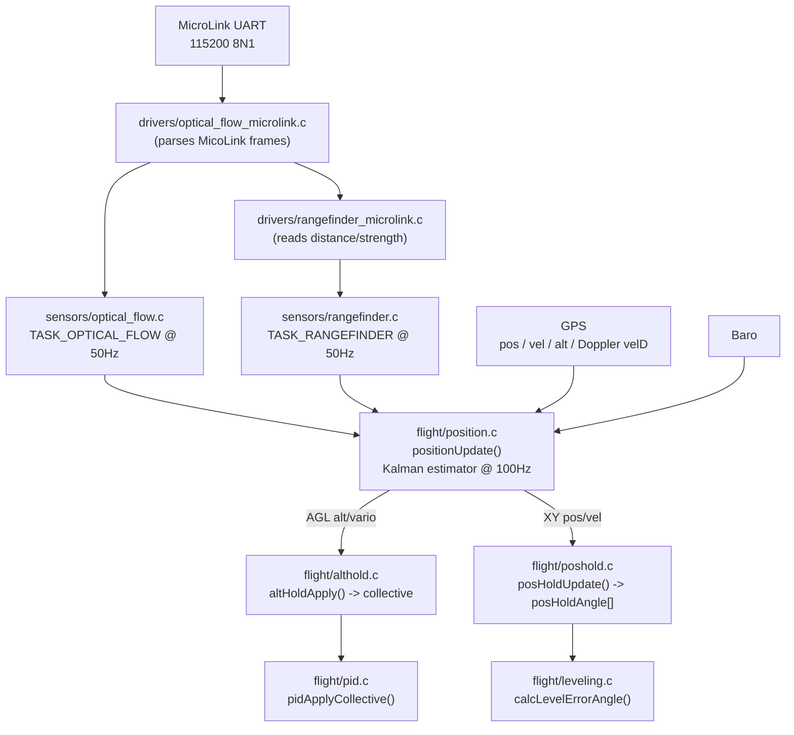

# MicroLink Optical Flow / LIDAR — Altitude Hold & Position Hold

This document describes the changes introduced on the `feature/microlink-alt-pos-hold`
branch (on top of `master` @ `2538b6486`). It covers the new
sensor driver, the new/changed configuration parameters, and a step-by-step guide
for wiring up, configuring and testing Altitude Hold and Position Hold with a
MicroLink MTF-01/MTF-02 module.

> **Status:** experimental / work in progress. See
> [Known limitations](#known-limitations) for what is still unresolved. Bench
> test extensively with props off before any flight test.

---

## 1. Summary of changes

| Area | Change |
| --- | --- |
| New sensor driver | MicroLink MTF-01/MTF-02 combined LIDAR + optical-flow sensor, communicating over a UART at 115200 8N1 using the MicoLink binary protocol |
| New sensor abstraction | A generic "optical flow" sensor layer (`sensors/optical_flow.*`, `drivers/optical_flow/*`), analogous to the existing rangefinder layer |
| Rangefinder | New `MICROLINK` rangefinder hardware option, sourced from the same MicroLink UART stream (shares the driver/port with the optical-flow data) |
| Altitude Hold | New, fully implemented cascade-PID altitude-hold controller (`flight/althold.*`) that prefers LIDAR AGL altitude when available and falls back to baro/GPS altitude |
| Position Hold | New feature (`flight/poshold.*`): a cascade-PID horizontal position-hold controller (P+I velocity loop) driven by the fused XY position/velocity estimate |
| New flight mode | `BOXPOSHOLD` / `POSHOLD_MODE` — new arming-mode box, requires `ALTHOLD_MODE` to also be active and a valid XY position estimate |
| Position estimator | `flight/position.c` now runs Kalman filters (`flight/kalman.*`): a 4-state vertical filter (altitude, vertical velocity, baro downwash bias, terrain offset) fed by IMU, baro, GPS and rangefinder, and East/North filters fed by IMU, GPS position/velocity and gyro-compensated optical-flow velocity. Also an AGL (rangefinder) altitude estimate |
| New task | `TASK_OPTICAL_FLOW` @ 50 Hz polls/parses the MicroLink UART stream |
| New debug modes | `DEBUG_OPTICAL_FLOW`, `DEBUG_ALTHOLD`, `DEBUG_POSHOLD`, `DEBUG_HARDDECK`, `DEBUG_POS_EST_Z`, `DEBUG_POS_EST_XY`, `DEBUG_POS_EST_TERRAIN` |
| Hard deck | New training feature (`flight/harddeck.*`, box `HARD DECK`): keeps the helicopter above a set altitude, recovering from any attitude and holding position — see [HardDeck.md](HardDeck.md) |
| New serial function | `FUNCTION_MICROLINK` (bit 23) — assign a UART to the MicroLink sensor |
| GPS provider | `gps_provider = CRSF` takes GPS from a CRSF sensor accessory (upstream's `FUNCTION_CRSF_SENSORS` port, bit 22). See [§3.1b](#31b-gps-providers) |
| New PID-profile fields | `pidProfile.althold.*`, `pidProfile.poshold.*` and `pidProfile.harddeck.*` gain/limit structs (see below) |
| Settings reset | `PG_PID_PROFILE` and `PG_POSITION` versions were bumped, so flashing this firmware **resets all PID profiles and `position_*` settings to defaults**. Save a `diff all` before flashing |

### Files added
```
src/main/drivers/optical_flow/optical_flow.h
src/main/drivers/optical_flow/optical_flow_microlink.c
src/main/drivers/optical_flow/optical_flow_microlink.h
src/main/drivers/rangefinder/rangefinder_microlink.c
src/main/drivers/rangefinder/rangefinder_microlink.h
src/main/sensors/optical_flow.c
src/main/sensors/optical_flow.h
src/main/pg/optical_flow.c
src/main/pg/optical_flow.h
src/main/flight/althold.c
src/main/flight/althold.h
src/main/flight/poshold.c
src/main/flight/poshold.h
src/main/flight/kalman.c
src/main/flight/kalman.h
src/main/flight/harddeck.c
src/main/flight/harddeck.h
src/test/unit/harddeck_unittest.cc
```

### Files modified (non-exhaustive, see `git diff master...HEAD --stat`)
```
make/source.mk, src/main/cli/settings.c, src/main/cli/settings.h,
src/main/fc/core.c, src/main/fc/rc_modes.h, src/main/fc/runtime_config.h,
src/main/fc/tasks.c, src/main/flight/leveling.c, src/main/flight/pid.c,
src/main/flight/position.c, src/main/flight/position.h, src/main/io/serial.h,
src/main/msp/msp_box.c, src/main/pg/pid.c, src/main/pg/pid.h,
src/main/pg/pg_ids.h, src/main/pg/position.h, src/main/pg/rangefinder.h,
src/main/scheduler/scheduler.h, src/main/sensors/initialisation.c,
src/main/sensors/rangefinder.c, src/main/sensors/sensors.h,
src/main/target/common_pre.h, src/main/build/debug.c, src/main/build/debug.h,
src/main/io/gps.c, src/main/io/gps.h, src/main/osd/osd_elements.c,
src/main/telemetry/crsf.c, src/main/pg/position.c, src/main/sensors/rangefinder.h
```

---

## 2. How the pieces fit together


```mermaid
flowchart TD
    UART["MicroLink UART\n115200 8N1"] --> DRV["drivers/optical_flow_microlink.c\n(parses MicoLink frames)"]
    DRV --> OF["sensors/optical_flow.c\nTASK_OPTICAL_FLOW @ 50Hz"]
    DRV --> RF["drivers/rangefinder_microlink.c\n(reads distance/strength)"]
    RF --> RFS["sensors/rangefinder.c\nTASK_RANGEFINDER @ 50Hz"]
    OF --> POS["flight/position.c\npositionUpdate()\nKalman estimator @ 100Hz"]
    RFS --> POS
    GPS["GPS\npos / vel / alt / Doppler velD"] --> POS
    BARO["Baro"] --> POS
    POS -->|AGL alt/vario| AH["flight/althold.c\naltHoldApply() -> collective"]
    POS -->|XY pos/vel| PH["flight/poshold.c\nposHoldUpdate() -> posHoldAngle[]"]
    AH --> PID["flight/pid.c\npidApplyCollective()"]
    PH --> LVL["flight/leveling.c\ncalcLevelErrorAngle()"]
```

* The MicroLink module sends **one** combined message containing both the LIDAR
  distance/strength and the optical-flow velocity/quality. Both the rangefinder
  driver and the optical-flow driver read from the **same** serial port/parser —
  you only need to wire up **one** UART and set **both** hardware options to
  `MICROLINK`.
* The driver passes the module's **raw** angular flow ("cm/s at 1 m") through
  unscaled. `position.c` converts it to ground velocity as
  `flow × AGL height / cos²(tilt)`, using the filtered, tilt-compensated AGL
  altitude, then rotates it by heading into East/North. A valid LIDAR reading
  is therefore required for optical flow to be fused. Flow is not fused at
  more than 45° of tilt or with a quality of 50/255 or less.
* The horizontal estimate fuses **GPS and optical flow** (`position_xy_source`,
  default `AUTO`). With GPS, the position is anchored to the first fix after
  arming. With flow only, it is dead-reckoned and clamped to 10 m from the
  arm point.
* Altitude Hold (`althold.c`) prefers the LIDAR AGL altitude
  (`isAGLAltitudeValid()`) and falls back to the existing baro/GPS blended
  altitude (`getAltitude()`) when the rangefinder is out of range or unreliable.
* Position Hold (`poshold.c`) requires **both**: a valid XY position estimate
  (`isPositionXYValid()`) **and** `ALTHOLD_MODE` to be active — Position Hold
  cannot be engaged on its own.
* Priority in the collective channel: **Hard Deck > Rescue > Altitude Hold >
  pilot stick**. Altitude Hold passes the collective through while rescue
  (including its exit blend), GPS rescue or failsafe is in control, and
  re-latches its target afterwards.
* While Position Hold is engaged, its angle command **replaces** the
  stick-derived self-level angle (the sticks then move the hold target). When
  it is not engaged, normal stick control is untouched.

---

## 3. New/changed CLI parameters

### 3.1 Sensor hardware selection (master values)

| Parameter | Values | Notes |
| --- | --- | --- |
| `rangefinder_hardware` | `NONE`, `HCSR04`, `TFMINI`, `TF02`, **`MICROLINK`** (new) | Select `MICROLINK` to source LIDAR altitude from the MicroLink UART |
| `optical_flow_hardware` | `NONE`, **`MICROLINK`** (new parameter/table) | Default is `MICROLINK`. New `PG_OPTICAL_FLOW_CONFIG` parameter group |
| `position_alt_source` | `DEFAULT`, `BARO_ONLY`, `GPS_ONLY`, **`LIDAR_ONLY`** (new) | When `LIDAR_ONLY` is selected, the general altitude/vario estimate (`getAltitude()`/`getEstimatedAltitudeCm()`, used by OSD/blackbox/telemetry) is sourced from the rangefinder AGL estimate, and the rangefinder is fused into the Kalman filter with 4× lower noise |
| `position_xy_source` (new) | `AUTO`, `GPS_ONLY`, `FLOW_ONLY` | Which sensors feed the horizontal estimate. Default `AUTO` fuses both |

### 3.1a Estimator tuning (master values, new)

| Parameter | Default | Meaning |
| --- | --- | --- |
| `position_est_q_accel_xy` | 50000 | Horizontal accel process noise, (cm/s²)² |
| `position_est_q_accel_z` | 20000 | Vertical accel process noise, (cm/s²)² |
| `position_est_r_baro_alt` | 600 | Baro altitude noise per raw sample, cm² |
| `position_est_r_lidar_alt` | 100 | Rangefinder altitude noise, cm² |
| `position_est_r_gps_pos` | 500 | GPS position noise floor, cm². u-blox: the receiver's hAcc² is used when larger. NMEA: scaled by HDOP². CRSF: floor under an assumed 2.5 m |
| `position_est_r_gps_vel` | 100 | GPS velocity noise floor, (cm/s)². u-blox: sAcc². NMEA: ×HDOP². CRSF: assumed 0.4 m/s |
| `position_est_r_flow_vel` | 400 | Optical-flow velocity noise at best quality, (cm/s)² |
| `position_est_r_gps_vvel` | 400 | GPS Doppler vertical velocity noise floor, (cm/s)² (u-blox only) |
| `position_est_q_baro_bias` | 400 | Baro downwash bias random walk, cm²/s |
| `position_est_q_terrain` | 200 | Terrain offset random walk, cm² per metre flown. Lets the LIDAR follow ground-height changes while moving without pulling the fused altitude; 0 freezes it |
| `position_flow_gyro_comp` | 100 | Optical-flow body-rate compensation, % (−200…200). 100 = physical value, 0 = off, negative for a module whose axes are mirrored. Verify with test 1 of the tuning doc, or measure it with the configurator's orientation check |
| `optical_flow_align` | `CW0` | Mounting of the flow sensor, seen from above: `CW0`/`CW90`/`CW180`/`CW270` = the sensor's X axis points that many degrees clockwise from the nose, `…FLIP` mirrors the sensor's Y axis first. Applied in `sensors/optical_flow.c`, so the debug fields, MSP and the estimator all see body-frame flow. Find it with the **Optical flow orientation** check in the configurator's Position & Hold tab |
| `position_baro_downwash_comp` | 30 | Baro downwash handling strength (×10), 0 = off. See [HardDeck.md](HardDeck.md#2-altitude-estimation-baro-in-the-downwash-gps-and-imu) |

`position_vario_lpf` still exists but no longer has any effect: the vario now
comes from the Kalman filter. `position_baro_alt_lpf` only affects the
arm-point offset tracking and the `ALTITUDE` debug fields; the filter fuses the
raw baro sample.

### 3.1b GPS providers

| `gps_provider` | Source | Quality information used by the estimator |
| --- | --- | --- |
| `UBLOX` | Serial GPS | hAcc/vAcc/sAcc per fix, Doppler N/E/D velocity. Best case |
| `NMEA` | Serial GPS | HDOP only |
| `MSP`, `FBUS` | As on master | HDOP 1.0 assumed by the transport |
| `CRSF` (new) | GPS frames from a CRSF sensor accessory on the `FUNCTION_CRSF_SENSORS` port (bit 22, `crsf_sensors_*` settings) | None. Assumed 2.5 m / 4 m / 0.4 m/s. A 3D fix is assumed at 4 or more satellites. Set `position_gps_min_sats` to what the accessory reports in practice |

A CRSF GPS may report at only 1 Hz. The estimator keeps GPS as the position
anchor for 2 s after each fix, so this works, but the IMU dead-reckons in
between and the position σ (`POS_EST_XY` field 6) breathes at the fix rate.

### 3.2 New serial port function

| Function | Bit | Notes |
| --- | --- | --- |
| `FUNCTION_MICROLINK` | `1 << 23` (8388608) | Assign to the UART physically connected to the MicroLink module. Fixed at 115200 baud 8N1, opened internally by the optical-flow driver — you do not choose the baud rate via the `serial` command for this function. Bit 22 is upstream's `FUNCTION_CRSF_SENSORS` |

### 3.3 New PID-profile CLI parameters

These fields were added to `pidProfile_t` (`pg/pid.h`) with compiled-in
defaults set in `pg/pid.c`, and are now exposed as regular per-profile CLI
values (`cli/settings.c`), so they can be read/changed with `get`/`set`,
saved/restored via `dump`/`diff`, and are visible in Configurator's CLI tab.

| CLI name | Field | Default | Range | Meaning |
| --- | --- | --- | --- | --- |
| `althold_alt_p_gain` | `althold.alt_p_gain` | 20 | 0-1000 | P gain ×10 (2.0), used for both loops: altitude error (m) → velocity setpoint (m/s), and velocity error (m/s) → collective (out of 1000) |
| `althold_alt_i_gain` | `althold.alt_i_gain` | 5 | 0-1000 | Velocity-loop integral gain |
| `althold_alt_d_gain` | `althold.alt_d_gain` | 15 | 0-1000 | Damping gain applied to vario (climb rate) |
| `althold_max_climb_rate` | `althold.max_climb_rate` | 200 | 10-1000 | Max commanded climb/descent rate, cm/s |
| `althold_stick_deadband` | `althold.stick_deadband` | 100 | 0-500 | Collective stick deadband, out of 1000 (10%) |
| `althold_hover_collective` | `althold.hover_collective` | 350 | 0-1000 | Feed-forward hover collective, out of 1000 |
| `poshold_pos_p_gain` | `poshold.pos_p_gain` | 50 | 0-1000 | Position error (cm) → velocity setpoint, ×100 scale (0.5 (cm/s)/cm) |
| `poshold_vel_p_gain` | `poshold.vel_p_gain` | 30 | 0-1000 | Velocity error (cm/s) → tilt angle, ×100 scale (0.3°/(cm/s)) |
| `poshold_vel_i_gain` | `poshold.vel_i_gain` | 10 | 0-1000 | Velocity-loop integral (wind trim), ×100 scale (0.1°/(cm/s)/s). Kept in the earth frame, so it survives yaw changes |
| `poshold_max_horiz_speed` | `poshold.max_horiz_speed` | 200 | 10-1000 | Max commanded horizontal speed, cm/s |
| `poshold_max_tilt_angle` | `poshold.max_tilt_angle` | 150 | 10-450 | Max tilt angle, degrees ×10 (15.0°) |
| `poshold_stick_deadband` | `poshold.stick_deadband` | 100 | 0-500 | Roll/pitch stick deadband, out of 1000 (10%) |

The `poshold_*` entries are compiled in whenever `USE_OPTICAL_FLOW` is defined
(which is unconditional for all targets in this branch).

### 3.4 New flight mode / box

| Box | Mode flag | Notes |
| --- | --- | --- |
| `ALTHOLD` (permanent id 3) | `ALTHOLD_MODE` (bit 4) | Existing box, now functional |
| `POSHOLD` (permanent id 58) | `POSHOLD_MODE` (bit 7) | New; must be mapped to an aux switch with `aux`. Requires `ALTHOLD` to also be active in the air, plus a valid XY position estimate |
| `HARD DECK` (permanent id 59) | `HARDDECK_MODE` (bit 8) | New, see [HardDeck.md](HardDeck.md) |

The new boxes are appended at the end of the internal box list, so existing
saved `aux` switches keep their meaning after flashing.

`BOXALTHOLD`/`ALTHOLD_MODE` already existed on `master` as a mode flag, but had
**no functional controller** wired to it — this branch is what makes Altitude
Hold actually work.

### 3.5 New debug modes

`OPTICAL_FLOW`, `ALTHOLD`, `POSHOLD`, `HARDDECK`, `POS_EST_Z`, `POS_EST_XY` and
`POS_EST_TERRAIN` (set with `set debug_mode = <name>`). The rangefinder AGL chain is in fields 4-7
of the existing `RANGEFINDER` mode. Each mode holds everything needed for one
tuning job; the field layouts and a blackbox test plan are in
[Blackbox-Tuning-AltHold-PosHold.md](Blackbox-Tuning-AltHold-PosHold.md).

---

## 4. Setup guide — wiring & configuration

### 4.1 Hardware

1. Wire the MicroLink MTF-01/MTF-02 module to a free UART on the flight
   controller (TX→RX, RX→TX, GND, and the module's own power rail per its
   datasheet). Mount it facing straight down, as level as possible, with a
   clear view of the ground (avoid gear/skids/vibration-prone mounts).
2. The module talks the MicoLink binary protocol at **115200 baud, 8N1** — this
   is fixed in the driver and not configurable from the flight controller CLI.

### 4.2 Firmware build

This feature is compiled in for all targets (`USE_RANGEFINDER` and
`USE_OPTICAL_FLOW` are now unconditionally defined in
[common_pre.h](src/main/target/common_pre.h)). Build normally, e.g. using the
`build-F405`/`build-F7X2`/`build-H743` VS Code tasks, or:
```
make TARGET=STM32F405 DEBUG=GDB -j4
```

### 4.3 CLI configuration

1. Identify a free UART (e.g. `UART3`) and assign the MicroLink function to it.
   Use the numeric identifier for your UART (UART1 = 0, UART2 = 1, …,
   UART6 = 5, USB VCP = 20; the `serial` CLI command lists them) and the
   `FUNCTION_MICROLINK` bitmask (8388608). Baud-rate arguments are ignored for
   this function but must still be supplied:
   ```
   serial 2 8388608 115200 57600 0 115200
   save
   ```
   (Adjust `2` to the identifier of the UART you actually wired up.)

2. Select the MicroLink hardware for both sensor slots:
   ```
   set rangefinder_hardware = MICROLINK
   set optical_flow_hardware = MICROLINK
   ```
   If the sensor is not mounted with its X axis to the nose, set
   `optical_flow_align` as well (or let the configurator's orientation check
   find it).

3. Enable the rangefinder feature (required for `TASK_RANGEFINDER`, and hence
   for LIDAR AGL altitude, to run):
   ```
   feature RANGEFINDER
   ```
   Optical flow does **not** need a `feature` flag — `TASK_OPTICAL_FLOW` is
   enabled automatically once `optical_flow_hardware` is set and a UART is
   assigned to `FUNCTION_MICROLINK` (detection checks that a port is
   configured, but still can't verify the module itself is physically
   connected/responding — see [Known limitations](#known-limitations)).

4. Map switches to the flight modes:
   ```
   aux 0 3 <aux_index> 1700 2100      ; ALTHOLD
   aux 1 58 <aux_index> 1700 2100     ; POSHOLD
   aux 2 59 <aux_index> 1700 2100     ; HARD DECK
   ```
   (`aux <slot> <permanentId> <aux_index> <rangeStart> <rangeEnd>`. The
   permanent ids are ALTHOLD = 3, POSHOLD = 58, HARD DECK = 59; **0 is ARM**.
   `<aux_index>` is 0 for AUX1, 1 for AUX2, and so on. Pick slots that are
   not already used (`aux` lists them), or use the Configurator Modes tab.)

5. Save:
   ```
   save
   ```

6. Tune the gains in [§3.3](#33-new-pid-profile-cli-parameters) directly with
   `set althold_alt_p_gain = <value>` etc. — no rebuild required.

---

## 5. Testing procedure

Test incrementally and always start props-off.

### 5.1 Bench test — sensor link

1. Power the FC with the MicroLink connected, props off.
2. `set debug_mode = OPTICAL_FLOW` (or `RANGEFINDER`), then watch the debug
   fields via `status`/blackbox/Configurator sensor tab, or arm blackbox
   logging (`feature BLACKBOX`) and inspect after a short recording.
3. Confirm:
   - Rangefinder shows a plausible distance (`rangefinder` in `status`, or the
     `DEBUG_RANGEFINDER` fields) as you move the module up/down over a surface.
   - `DEBUG_OPTICAL_FLOW` fields 0/1 (flowX/flowY) change when you tilt/pan the
     module by hand, and field 2 (quality) is non-zero over textured surfaces.
4. If nothing shows up: double-check UART wiring/TX-RX swap, that
   `serial <n> 8388608 ...` and both `_hardware` settings were saved (`dump`),
   and that no other function is already assigned to that UART.

### 5.2 Bench test — altitude hold logic (props off, bench/gimbal)

1. `set debug_mode = ALTHOLD`.
2. Prop off, on the bench, raise/lower the aircraft or the sensor by hand over
   a table with a lipo connected and motors disarmed to confirm distance
   tracks.
3. Arm on a safe bench stand with props off (if your setup allows arming
   without props), enable `ALTHOLD`, and verify via debug fields that the
   target (field 0) latches on mode entry, field 7 has the engaged flag (value 1) set, and
   the output (field 6) responds sensibly to simulated altitude change
   (moving the sensor/board by hand).
4. Disable the mode and confirm field 7 drops to not engaged and field 6
   follows the collective stick again.

### 5.3 First flight test — Altitude Hold only

1. Fly a normal hover in Acro/Angle mode first to confirm baseline handling.
2. At a safe, moderate altitude, engage `BOXALTHOLD` only (leave `BOXPOSHOLD`
   disengaged) and:
   - Verify the helicopter holds altitude with hands off the collective.
   - Test small collective stick inputs move the target altitude smoothly and
     the aircraft returns to holding once you release the stick.
   - Have your hand ready on the collective/mode switch to disengage instantly
     if the response is aggressive or oscillates. Be conservative on the first
     flights — start with the default gains and reduce
     `althold_hover_collective`/the P gains via CLI for your specific aircraft
     before flight, rather than assuming the defaults are correct for it.
3. Disengage and land if anything looks wrong; re-tune with `set
   althold_alt_p_gain = <value>` (and the other `althold_*` parameters) and
   repeat.

### 5.4 Position Hold test (only after Altitude Hold is verified good)

1. Confirm `isPositionXYValid()` conditions can be met: the aircraft needs a
   good, in-range LIDAR distance (for flow scaling) and adequate ground
   texture/lighting for the optical flow sensor.
2. Hover in Altitude Hold, then engage `BOXPOSHOLD`:
   - It only activates if `ALTHOLD_MODE` is already active and the XY position
     estimate is valid; otherwise `posHoldAngle` stays at zero and it has no
     effect (with `debug_mode = POSHOLD` all fields read 0 while it is not
     engaged; `POS_EST_XY` field 7 flag 1 (valid) shows whether the XY estimate is
     valid).
   - Verify the aircraft resists drift and returns toward the hold point.
   - Gently move the aircraft's own commanded position via roll/pitch stick
     (outside the stick deadband) and confirm the hold target shifts and
     re-settles when you release the sticks.
3. Watch for the position estimate becoming invalid mid-flight (e.g. flying
   over a low-texture/low-light surface, or out of LIDAR range) — Position
   Hold should disengage its angle contribution automatically
   (`isPositionXYValid()` returns false), but always keep a hand ready to
   switch back to normal Angle/Acro mode.
4. Try nudging the hold position with roll/pitch stick at a few different
   headings (yaw left/right, then nudge again) to confirm the hold target
   moves in the direction you actually commanded — this exercises the
   heading-relative stick rotation described in
   [Known limitations](#known-limitations).
5. Without GPS (`FLOW_ONLY`, or no fix), the position is dead-reckoned from
   flow velocity and drifts over time. Expect the hold point to wander on
   long holds. With a GPS fix in `AUTO`, GPS anchors the position and the
   drift is bounded by GPS accuracy.

---

## 6. Known limitations

### Fixed in this pass

The following issues were identified while documenting the branch and have
since been fixed in the source:

- **`ALTHOLD`/`POSHOLD` modes could never activate** — the boxes were never
  enabled in `initActiveBoxIds()` and the RC switch was never mapped onto
  `ALTHOLD_MODE`/`POSHOLD_MODE` in `processRxModes()`, so both controllers
  stayed dormant. Both are now wired up like the other flight modes.
- **Baro downwash / GPS fusion** — the Z estimator now carries a baro-bias
  state (estimated against GPS altitude, GPS Doppler vertical velocity and the
  rangefinder), inflates baro noise during rotor transients and fuses GPS
  once per message. See [HardDeck.md](HardDeck.md#2-altitude-estimation-baro-in-the-downwash-gps-and-imu).

- **CLI/MSP access to `althold.*`/`poshold.*` gains** — added as
  `althold_alt_p_gain`, `poshold_pos_p_gain`, etc. (see
  [§3.3](#33-new-pid-profile-cli-parameters)); no rebuild needed to tune.
- **`position_alt_source = LIDAR_ONLY` was a no-op** — `LIDAR_ONLY` is now in
  the CLI lookup table, and `positionUpdate()` now sources the general
  altitude/vario estimate from the rangefinder AGL reading when it's
  selected (falls back to `0` when the AGL reading isn't valid). The
  baro/GPS `have*Alt` flags are also now reset when their source isn't
  selected, instead of possibly holding a stale reading.
- **Sensor "detection" accepted no wiring at all** —
  `opticalFlowMicrolinkDetect()` and `rangefinderMicrolinkDetect()` now
  require a UART to actually be assigned to `FUNCTION_MICROLINK`
  (`findSerialPortConfig()`) before reporting the sensor as present; the
  rangefinder detect additionally requires `optical_flow_hardware ==
  MICROLINK`, since it depends on that driver to own the shared UART. This
  still does not perform a real handshake with the physical module (see
  below).
- **Position Hold stick input ignored heading** — `poshold.c` moved the hold
  target directly along East/North using the raw roll/pitch stick
  regardless of yaw, which only matched the earth-frame position estimate
  (which *is* yaw-aware via the IMU rotation matrix) when the aircraft was
  pointed due north. Stick input is now rotated from body frame
  (right/forward) into earth frame (East/North) using `attitude.values.yaw`
  before being applied, so nudging the hold point moves it in the direction
  actually commanded regardless of heading.

- **Optical flow was not compensated for the vehicle's own rotation**, the baro
  was fused 1 Hz-filtered on every 100 Hz tick, the u-blox accuracy estimates
  were dropped and the rangefinder was an absolute altitude after alignment.
  All four are addressed in the sensor fusion rework; see
  `SENSOR_FUSION_ARCHITECTURE.md` in the workspace root.

### Still open

- **Optical-flow/rangefinder detection still isn't a real hardware
  handshake.** The fix above only checks that a UART is *configured* for
  `FUNCTION_MICROLINK`; there's still no identification/handshake with the
  physical module at detect time. A configured-but-disconnected sensor will
  be reported as "detected" and will only be caught later, at runtime, via
  `opticalFlowIsHealthy()` (500 ms response timeout).
- **Flow-only position drifts.** Without GPS, the XY position integrates
  optical-flow velocity, so its error accumulates over time. GPS fusion
  (`position_xy_source = AUTO` or `GPS_ONLY`) removes this when a fix is
  available. There is no magnetometer fusion in the estimator, so heading
  drift rotates the flow velocity.
- **Position estimate silently resets/clamps.** While no GPS fix is being
  fused, the position is clamped to a 1000 cm radius from the arm-time origin
  (`POSXY_MAX_DEADRECKONING_CM`). The estimate is marked invalid after 500 ms
  without a fused GPS or flow sample — expect hold behaviour to degrade over long
  flights or after periods of poor flow quality. This is a deliberate safety
  clamp rather than a bug, but it's worth knowing about before trusting long
  position holds.
- **Single shared UART/module.** The rangefinder and optical-flow drivers
  both read the *same* underlying MicoLink data stream through one shared
  internal buffer (`microlinkData`), so only a single MicroLink module/UART
  is supported at a time. Supporting multiple modules would need a larger
  refactor of the driver layer (per-instance state instead of a single
  static struct).
